# 1. 调试分析 Linux 0.00 引导程序

> `boot` 程序的主要功能是把软盘或映像文件中的 `head` 内核代码加载到内存某个指定位置处，并在设置好临时 `GDT` 表等信息后，把处理器设置成运行在保护模式下，然后跳转到 `head` 代码处去运行内核代码。

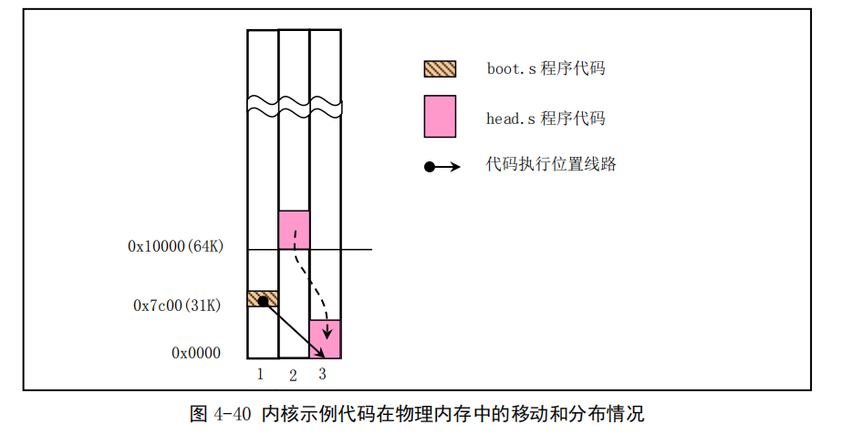


#### 1. 请简述 `head.s` 的工作原理

`head.s` 程序运行在 32 位保护模式下，其中主要包括初始设置的代码、时钟中断 `int 0x08` 的过程代码、系统调用中断 `int 0x80` 的过程代码以及任务 A 和任务 B 等的代码和数据。

其中初始设置工作主要包括：

① 重新设置 `GDT` 表；

② 设置系统定时器芯片；

③ 重新设置 `IDT` 表并且设置时钟和系统调用中断门；

④ 移动到任务 A 中执行。

为了每隔 10 毫秒切换运行的任务，`head.s` 程序中把定时器芯片 `8253` 的通道 0 设置成每经过 10 毫秒就向中断控制芯片 `8259A` 发送一个时钟中断请求信号。`PC` 机的 `ROM BIOS` 开机时已经在 `8259A` 中把时钟中断请求信号设置成中断向量 8，因此我们需要在中断 8 的处理过程中执行任务切换操作。任务切换的实现方法是查看 `current` 变量中当前运行任务号。如果 `current` 当前是 0，就利用任务 1 的 `TSS` 选择符作为操作数执行远跳转指令，从而切换到任务 1 中执行，否则反之。

每个任务在执行时，会首先把一个字符的`ASCII`码放入寄存器`AL`中，然后调用系统中断调用`int 0x80`，而该系统调用处理过程则会调用一个简单的字符写屏子程序，把寄存器 `AL` 中的字符显示在屏幕上，同时把字符显示的屏幕的下一个位置记录下来，作为下一次显示字符的屏幕位置。在显示过一个字符后，任务代码会使用循环语句延迟一段时间，然后又跳转到任务代码开始处继续循环执行，直到运行了 10 毫秒而发生了定时中断，从而代码会切换到另一个任务去运行。

#### 2. 请记录 `head.s` 的内存分布状况，写明每个数据段，代码段，栈段的起始与终止的内存地址

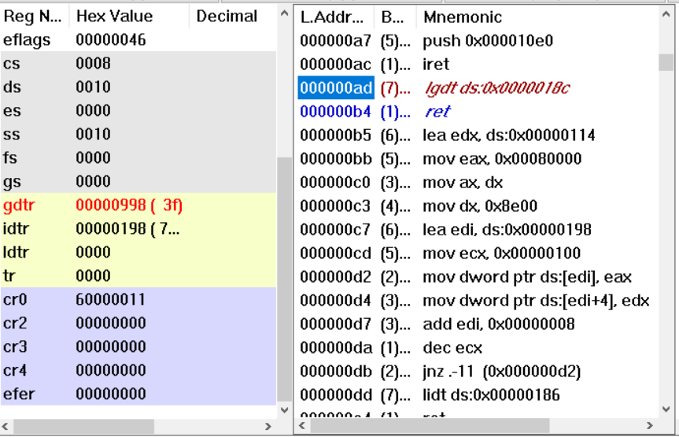

`gdtr`为`0x998`,所以`gdt`首地址为`0x998`

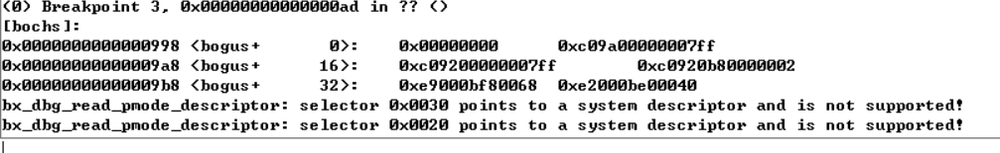

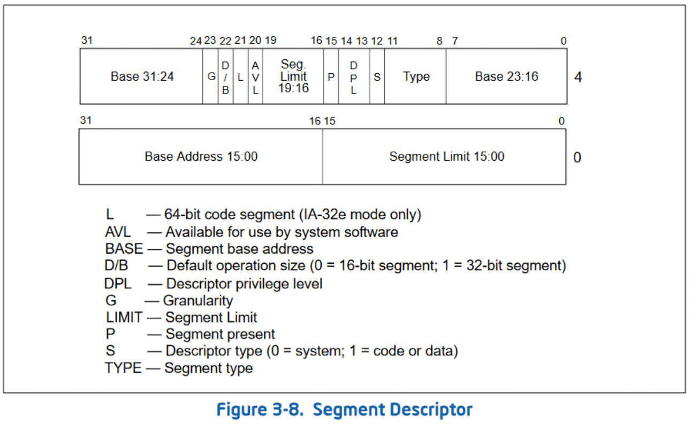

- `GDT`

  ***`GDT`起始地址为`0x998`，界限为`0x3f`，结束地址为`0x9D7`。***

  - **内核代码段**

    0xc09a00000007ff   

    0000 0000 1100 **0000** 1001 1010 0000 0000 

    0000 0000 0000 0000 **0000 0111** **1111 1111**

    `s=1`，`type=1010（A）`为代码段,`G=1`，段限长为`0x7ff`，基地址为0。实际段长度为`8MB`。

  - **内核数据段**

    0x00c09200000007ff

    0000 0000 1100 0000 1001 0010 0000 0000 

    0000 0000 0000 0000 0000 0111 1111 1111

    S为1，TYPE为3，为栈段，G为1，段限长为0x7FF ，基地址为0。实际段长度为8MB。

  - **显示内存段**

    0x00c0920b80000002

    <u>0000 0000</u> 1100 **0000** 1001 0010 <u>0000 1011</u> 

    <u>1000 0000 0000 0000</u> **0000 0000 0000 0010**

    基地址为0xb8000，段限长为2，G被设置，起始地址为0xb8000，长度为12kb。

    

  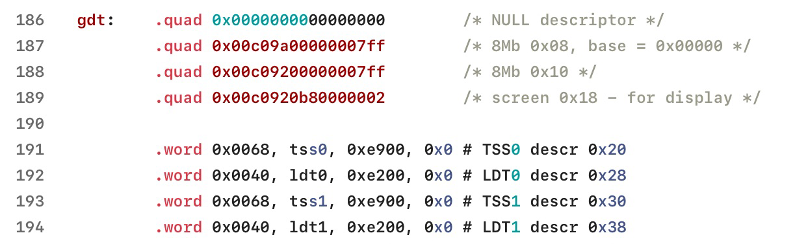

  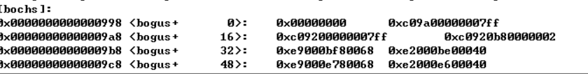

  - **`TSS0`**

    0xe9000bf80068

    <u>0000 0000</u> 0000 0000 1110 1001 <u>0000 0000</u> 

    <u>0000 1011 1111 1000</u> 0000 0000 0110 1000

    `type`=1001b,为仅执行代码段，基地址为0xbf8，段限长为0x68,G=0，起始地址为0xbf8，长度为105b。

  - **`LDT0`**

    `type`=0010b,为可读可写数据段，基地址为0xbe0，段限长为0x40,G=0，起始地址为0xbe0，长度为65b。

  - **`TSS1`**

    只有基地址不同，其起始地址为 0xE78，长度为 105 B。

  - **`LDT1`**

    只有基地址不同，其起始地址为 0xE60，长度为 65B。

- **`IDT`**

  `IDT`起始地址为*`0x198`*，段限制为`0x7ff`。总长度为`2048B`，结束地址为`0x997`。

- **`init_stack`**

  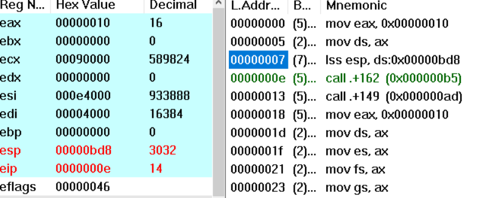

  !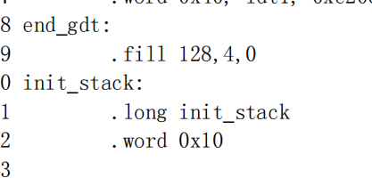

​         栈顶地址为`0xbd8`，.fill填充了`512B=0x200B`,栈底地址为`0x9d8`。

- **`krn_stk0`**

   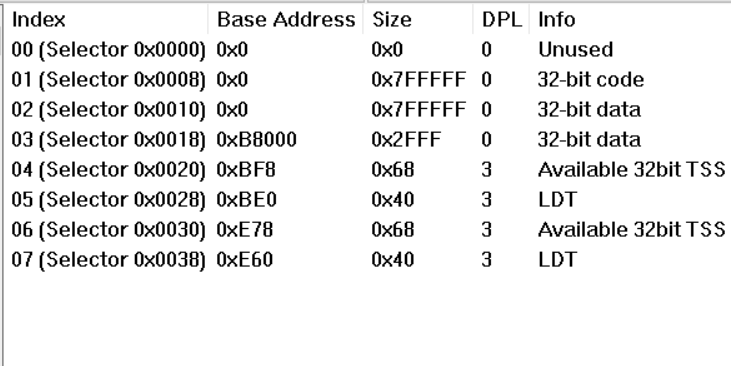

   栈顶地址为 `0xE60`，使用了 .fill 指令填充了 512 字节，因此栈底地址为 0xC60。

- **`krn_stk1`**

  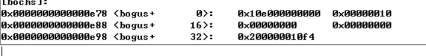

  栈顶地址为 `0x10E0`，栈底地址为 `0x0EE0`。

- **`usr_stk1`**

  栈顶地址为 `0x1308`，栈底地址为 `0x1108`。

  

#### 3. 简述 `head.s` `57` 至 `62` 行在做什么？

##### 在堆栈中人工建立中断返回时的场景。

```
57  pushl $0x17
58  pushl $init_stack
59  pushfl
60  pushl $0x0f
61  pushl $task0
62  iret
```

57：将任务0当前局部空间数据段选择符入栈，

58：将堆栈指针入栈，

59：将标志寄存器值入栈，

60：将当前局部空间代码段选择符入栈，

61：将代码指针入栈，

62：通过执行中断返回指令，切换到特权级3的任务0执行。

#### 4. 简述 `iret` 执行后， `pc` 如何找到下一条指令？

在保护模式下，`IRET` 指令的操作取决于 `EFLAGS` 寄存器中的 `NT`（嵌套任务）和 `VM` 标志的设置，以及存储在当前堆栈中的 `EFLAGS` 映像中的 `VM` 标志的设置。根据这些标志的设置，处理器会执行以下类型的中断返回操作：

1. 从虚拟8086 模式返回
2. 返回到虚拟8086 模式
3. 权限内返回、权限间返回
4. 任务切换

`IRET` 指令将返回指令指针、返回代码段选择器和 `EFLAGS` 映像分别从堆栈弹出到 `EIP`、`CS` 和 `EFLAGS` 寄存器，然后恢复执行被中断的程序。如果返回到另一个权限级别，`IRET` 指令还会从堆栈中弹出堆栈指针和 `SS`，然后再继续执行程序。

#### 5. 记录 `iret` 执行前后，栈是如何变化的？

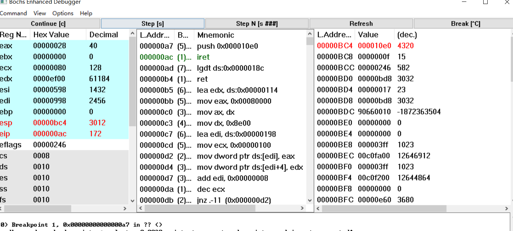

在`iret`执行前，`eip`的值为`0xac`,esp为`0xbc4`

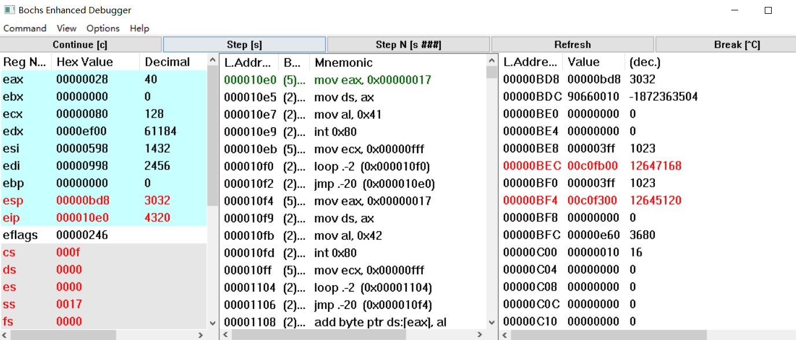

栈内五条内容均被弹出，其中`0x10e0`被写入`eip`，同时`0xf`被写入`cs`，则获得了下一条指令的地址。

#### 6. 当任务进行系统调用时，即 `int 0x80` 时，记录栈的变化情况

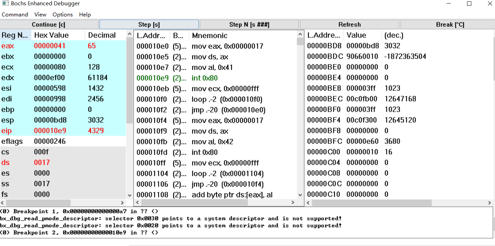

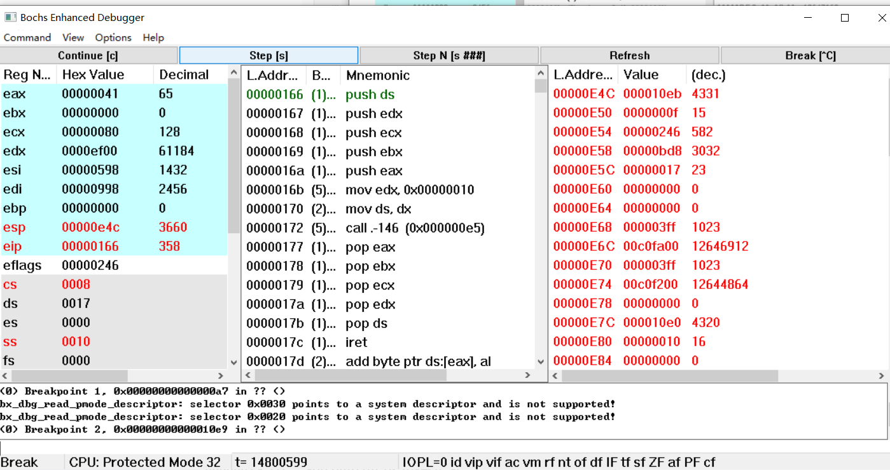

由于执行前任务特权级为3，而执行后任务特权级为0，所以进行了栈切换。压入了中断前的`ss`、栈指针、标志寄存器、`cs`和下一条指令的`eip`。`ss`寄存器的值也发生了相应变化。


