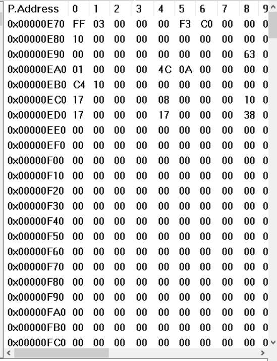

# 2. 调试分析 Linux 0.00 多任务切换

#### 2.1 当执行完 `system_interrupt` 函数，执行 `153` 行 `iret` 时，记录栈的变化情况。

执行前


执行后


在 `iret` 之后，执行的代码的**特权级别发生了变化**（由 0 变为了 3）

#### 2.2 模式切换

在进入中断时，通过查询`IDT`表，获得索引，之后进行特权级检查，要求`CPL`≤`DPL`，特权级检查通过，则特权级改变，栈也进行切换。

处理器从当前任务的`TSS`段获得该中断使用的堆栈的段选择符与栈指针，然后把被中断的栈选择符与栈指针压入新栈。当退出时，使用`iret`指令。把保存的寄存器内容恢复到`EFLAGES`中，完成特权级复原，即切换为3。同时栈也切换回原来的栈。

#### 2.3 从任务 `0` 切换到任务 `1` 的过程


```
122 mov %ax, %ds
123 movb $0x20, %al # 然后立刻允许其他硬件中断，即向 8259A 发送 EOI 命令。
124 outb %al, $0x20
125 movl $1, %eax # 接着判断当前任务，若是任务 1 则去执行任务 0，或反之。
126 cmpl %eax, current
127 je 1f
128 movl %eax, current # 若当前任务是 0，则把 1 存入 current，并跳转到任务 1
129 ljmp $TSS1_SEL, $0 # 去执行。注意跳转的偏移值无用，但需要写上。
130 jmp 2f
131 1: movl $0, current # 若当前任务是 1，则把 0 存入 current，并跳转到任务 0
132 ljmp $TSS0_SEL, $0 # 去执行。
```

当时钟中断发生时任务号为0，跳入时钟中断后把1写入寄存器`eax`,因为当前任务号为0，执行128行，跳转到任务一。

当发生时钟中断时，将会从任务 0 的代码切换到中断处理程序中继续执行。观察到此时的 CS 寄存器的值为 `0x008` ，可以得知中断处理程序 timer_interrupt 的特权级为 0 内核级，因此发生了模式切换


`tss`有变化


#### 2.4 从任务1切换回到任务 `0`

```
228 task1:
229 movl $66, %al # 把需要显示的字符'B'放入 AL 寄存器中。
230 int $0x80 # 执行系统调用，显示字符。
231 movl $0xfff, %ecx # 延时一段时间，并跳转到开始处继续循环显示。
232 1: loop 1b
233 jmp task1
234 
235 .fill 128,4,0 # 这是任务 1 的用户栈空间。
236 usr_stk1:
```

```
122 mov %ax, %ds
123 movb $0x20, %al # 然后立刻允许其他硬件中断，即向 8259A 发送 EOI 命令。
124 outb %al, $0x20
125 movl $1, %eax # 接着判断当前任务，若是任务 1 则去执行任务 0，或反之。
126 cmpl %eax, current
127 je 1f
128 movl %eax, current # 若当前任务是 0，则把 1 存入 current，并跳转到任务 1
129 ljmp $TSS1_SEL, $0 # 去执行。注意跳转的偏移值无用，但需要写上。
130 jmp 2f
131 1: movl $0, current # 若当前任务是 1，则把 0 存入 current，并跳转到任务 0
132 ljmp $TSS0_SEL, $0 # 去执行。
133 2: popl %eax
134 pop %ds
135 iret
```

从`task1`开始运行，在232中循环，在循环进行时时间中断发生，在126行比较时此时任务号为1，跳转到131行，将任务号设为0。执行到132行时执行任务0。

寄存器变化：


任务0 `TSS`


任务1 `TSS`



由于从任务 1 切换到任务 0 时，不需要修改、只需要加载 `TSS0`，因此 `TSS0` 中字段的值并没有发生变化。`TSS1` 由于需要保存任务 1 的状态，字段值发生了变化。`EFLAGS` 寄存器的值：在 `ljmp` 指令执行前后，`TSS1` 中保存的 `EFLAGS` 寄存器的值由 0x00000200 变为了 0x00000046，保存的 `CS` 寄存器的值由 0x000F 变为了 0x0008，`DS` 和 `SS` 寄存器的值都由 0x0017 变为了 0x0010。

#### 2.5 详细总结任务切换的过程


```
118 timer_interrupt:
119 push %ds
120 pushl %eax
121 movl $0x10, %eax # 首先让 DS 指向内核数据段。
122 mov %ax, %ds
123 movb $0x20, %al # 然后立刻允许其他硬件中断，即向 8259A 发送 EOI 命令。
124 outb %al, $0x20
125 movl $1, %eax # 接着判断当前任务，若是任务 1 则去执行任务 0，或反之。
126 cmpl %eax, current
127 je 1f
128 movl %eax, current # 若当前任务是 0，则把 1 存入 current，并跳转到任务 1
129 ljmp $TSS1_SEL, $0 # 去执行。注意跳转的偏移值无用，但需要写上。
130 jmp 2f
131 1: movl $0, current # 若当前任务是 1，则把 0 存入 current，并跳转到任务 0
132 ljmp $TSS0_SEL, $0 # 去执行。
133 2: popl %eax
134 pop %ds
135 iret

```

```
220 task0:
221 movl $0x17, %eax # 首先让 DS 指向任务的局部数据段。
222 movw %ax, %ds # 因为任务没有使用局部数据，所以这两句可省略。
223 movl $65, %al # 把需要显示的字符'A'放入 AL 寄存器中。
224 int $0x80 # 执行系统调用，显示字符。
225 movl $0xfff, %ecx # 执行循环，起延时作用。
226 1: loop 1b
227 jmp task0 # 跳转到任务代码开始处继续显示字符。
```

```
228 task1:
229 movl $66, %al # 把需要显示的字符'B'放入 AL 寄存器中。
230 int $0x80 # 执行系统调用，显示字符。
231 movl $0xfff, %ecx # 延时一段时间，并跳转到开始处继续循环显示。
232 1: loop 1b
233 jmp task1
234 
235 .fill 128,4,0 # 这是任务 1 的用户栈空间。
236 usr_stk1:
```

第一次切换，当在任务0中时跳入时钟中断后，从125行开始进行转换，首先将1写入寄存器`eax`，进行判断，因为此时任务号为0，所以不执行127行，执行128行，则将任务号改为1，然后在129行跳转到任务1的代码段。从代码段`task1`执行，在232行代码循环，在循环时进行时间中断发生，在126行比较时，由于此时任务号为1，所以跳转到131行，将任务号设为0，在132行处，跳转到任务0，由于任务0执行到129行，所以跳转到133行，弹栈后通过`iret`返回，由于上次为在226行触发中断，所以回到226行。再次遇到时间中断，从125行开始进行转换，首先将1写入寄存器`eax`，然后判断，因为此时任务号为0，所以不执行127行，执行128行，则将任务号改为1，然后在129行跳转到任务1。由于任务1上次执行至132行，所以从133行开始，到`iret`返回至232行。在232行遇到时钟中断，执行到126行比较后跳转到131行，将任务号变为0，回到任务0的代码段。


