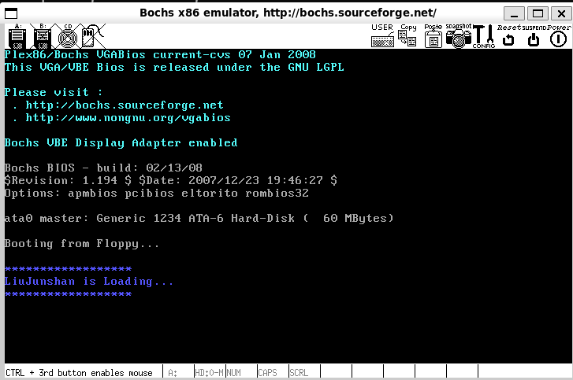
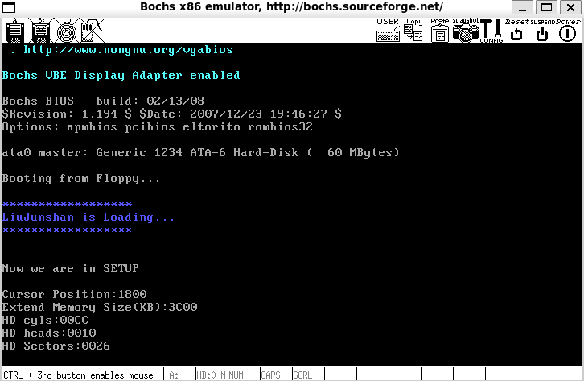
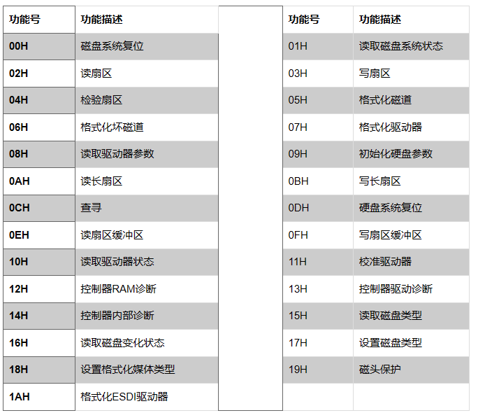

# 3. 操作系统的引导

### 3.1 实验结果 





### 3.2 实验过程

#### 3.2.1 `bootsect.s` 能在屏幕上打印一段提示信息

```
	mov	ah,#0x03		! 读取光标位置
	xor	bh,bh           
	int	0x10
	
	mov	cx,#70
	mov	bx,#0x0009		! page 0, attribute 7 (normal)
	mov	bp,#msg1
	mov	ax,#0x1301		! 显示字符串
	int	0x10
	
	
	msg1:
	.byte 13,10
	.ascii "******************"
	.byte 13,10
	.ascii "LiuJunshan is Loading..."
	.byte 13,10 
	.ascii "******************"
	.byte 13,10,13,10

.org 510
boot_flag:
	.word 0xAA55

```

| **AH** |  **功能**  |                      **调用参数**                      |                      **返回参数/ 注释**                      |
| :----: | :--------: | :----------------------------------------------------: | :----------------------------------------------------------: |
|   1    | 置光标类型 |     （CH）0―3 = 光标开始行 （CL）0―3 = 光标结束行      |                                                              |
|   2    | 置光标位置 |               BH = 页号 DH = 行 DL = 列                |                                                              |
|   3    | 读光标位置 |                       BH = 页号                        |       CH = 光标开始行 CL = 光标结束行 DH = 行、DL = 列       |
|   13   | 显示字符串 | ES:BP = 串地址、CX = 串长度、DL = 起始行列、 BH = 页号 | 光标返回起始位置   光标跟随移动光标返回起始位置       光标跟随串移动 |

```
 $ hexdump -C bootsect
    00000000  ea 05 00 c0 07 b8 c0 07  8e c0 b4 03 30 ff cd 10  |............0...|
    00000010  b9 18 00 bb 07 00 bd 45  00 b8 01 13 cd 10 ba 00  |.......E........|
    00000020  00 b9 02 00 bb 00 02 b8  02 02 cd 13 73 0a ba 00  |............s...|
    00000030  00 b8 00 00 cd 13 eb e6  b8 00 90 8e d0 bc 00 ff  |................|
    00000040  ea 00 00 e0 07 0d 0a 42  6f 6f 74 69 6e 67 20 56  |.......Booting V|
    00000050  52 61 79 20 4f 53 2e 2e  2e 0d 0a 0d 0a 00 00 00  |Ray OS..........|
    00000060  00 00 00 00 00 00 00 00  00 00 00 00 00 00 00 00  |................|
    *
    000001f0  00 00 00 00 00 00 00 00  00 00 00 00 00 00 55 aa  |..............U.|
    00000200
```


#### 3.2.2 `bootsect`正确读入`setup`

- 去除刚刚使用的无限循环，在其后继续添加读入 `setup.s` 的代码。
- `SETUPLEN` 被定义为了 2

```
load_setup:
    mov    dx,#0x0000               !设置驱动器和磁头(drive 0, head 0): 软盘0磁头
    mov    cx,#0x0002               !设置扇区号和磁道(sector 2, track 0):0磁头、0磁道、2扇区
    mov    bx,#0x0200               !设置读入的内存地址：BOOTSEG+address = 512，偏移512字节
    mov    ax,#0x0200+SETUPLEN      !设置读入的扇区个数(service 2, nr of sectors)，
                                  !SETUPLEN是读入的扇区个数，Linux 0.11设置的是4，
                                    !我们不需要那么多，我们设置为2
    int    0x13                     !应用0x13号BIOS中断读入2个setup.s扇区
    jnc    ok_load_setup            !读入成功，跳转到ok_load_setup: ok - continue
    mov    dx,#0x0000               
    mov    ax,#0x0000               !否则复位软驱 reset the diskette
    int    0x13
    jmp    load_setup               !重新循环，再次尝试读取
ok_load_setup:
                                    !接下来要干什么？当然是跳到setup执行。
```



功能 02H

功能描述：读扇区

入口参数：AH＝02H

AL＝扇区数

CH＝柱面

CL＝扇区

DH＝磁头

DL＝驱动器，00H~7FH：软盘；80H~0FFH：硬盘

ES:BX＝缓冲区的地址

出口参数：CF＝0——操作成功，AH＝00H，AL＝传输的扇区数，否则，AH＝状态代码


#### 3.2.3 `setup` 获取硬件参数，正确显示硬件参数

`setup.s` 将获得硬件参数放在内存的 `0x90000` 处。 `setup.s` 中已经完成了光标位置、内存大小、显存大小、显卡参数、第一和第二硬盘参数的保存。

| 参数       | 保存位置               |
| ---------- | ---------------------- |
| 光标位置   | `0x90000` —— `0x90002` |
| 内存大小   | `0x90002` —— `0x90004` |
| 磁盘柱面数 | `0x90004`—— `0x90006`  |
| 磁盘头数   | `0x90006` —— `0x90008` |


```
mov ax,#SETUPSEG
mov es,ax
mov cx,#25
mov bx,#0x0007
mov bp,#msg2
mov ax,#0x1301
int 0x10

msg2:
    .byte 13,10
	.ascii "Now we are in SETUP"
	.byte 13,10,13,10
```

打印Now we are in SETUP

```
	mov	ah,#0x88
	int	0x15
	mov	[2],ax
```

内存大小存在9002处

返回拓展内存大小：

功能号：AH = 88H

返回参数：读成功 ⇒  CF = 0 ，AX中存从绝对地址100000H开始的KB数。

　　　　　读失败 ⇒ AH = 错误码 ，80H表示非法命令，86H表示不支持该方法。

```
	mov	ax,#0x0000
	mov	ds,ax
	lds	si,[4*0x41]
	mov	ax,#INITSEG
	mov	es,ax
	mov	di,#0x0080
	mov	cx,#0x10
	rep
	movsb
```

源地址DS：SI；目的地址ES：DI

直接指向9004

```
print_cur:
  mov ah,#0x03
  xor bh,bh
  int 0x10        !先读光标位置，返回值在dx中
  mov ax,#SETUPSEG
  mov es,ax
  mov cx,#16
  mov bx,#0x0007
  mov bp,#msg3
  mov ax,#0x1301
  int 0x10
  
  xor di,di
  mov ax,#INITSEG
  mov ds,ax
  mov bx,(di)
  call print_bx
```

打印光标位置9000处

```
!打印bx中的参数	
print_bx:
   mov cx,#4
   mov dx,bx
print_digit:
   rol dx,#4
   mov ax,#0x0e0f
   and al,dl
   add al,#0x30
   cmp al,#0x3a
   jb outp
   add al,#0x07
outp:
   int 0x10
   loop print_digit
!打印回车
print_nl:
   mov ax,#0x0e0d
   int 0x10
   mov al,#0x0a
   int 0x10
   ret

```

只要在适当的位置调用 `print_bx` 和 `print_nl`就能将获得的硬件参数打印到屏幕上。

### 3.3 实验报告问题

#### 3.3.1 `bootsect.s`

计算机上电，BIOS初始化中断向量表之后，会将启动设备的第一个扇区(即引导扇区)读入内存地址`0x07c00(31kb)`处，并跳转到此处执行，由此系统的控制权由`BIOS`转交给`bootsect.s`。而为了方便加载内核模块，`bootsect.s`首先将自己移动到`0x90000(576kb)`处。

替代方案：在设计`ROM BIOS`程序时，使其在自检后直接将引导扇区代码加载到`0x90000`处并执行。或者不修改BIOS，在`BIOS`将引导扇区代码加载到`0x07C00`处并执行后，`bootsect`不复制自身，而是直接加载setup模块至`0x90200`处。

#### 3.3.2 `system`模块

计算机上电后，BIOS会在物理地址0处开始初始化中断向量表，其中有256个中断向量，每个中断向量占用4个字节，共1KB，在物理内存地址`0x00000-0x003fff`处，这些中断向量供BIOS中断使用。这就要求，如果操作系统的引导程序在加载操作系统时使用了BIOS中断来获取或显示一些信息时，内存中这最开始的1KB数据不能被覆盖。`bootsect`模块将system模块加载到内存`0x10000`处，之后`setup`模块又将`system`模块向下移至内存`0x00000`处。

替代方案：由于在设计中，`system`模块的最大值设计为`0x3000`节，即使内核达到`512KB`的大小，内存空间也足以存放下`system`模块。因此可以不必再将`system`模块向下移动。