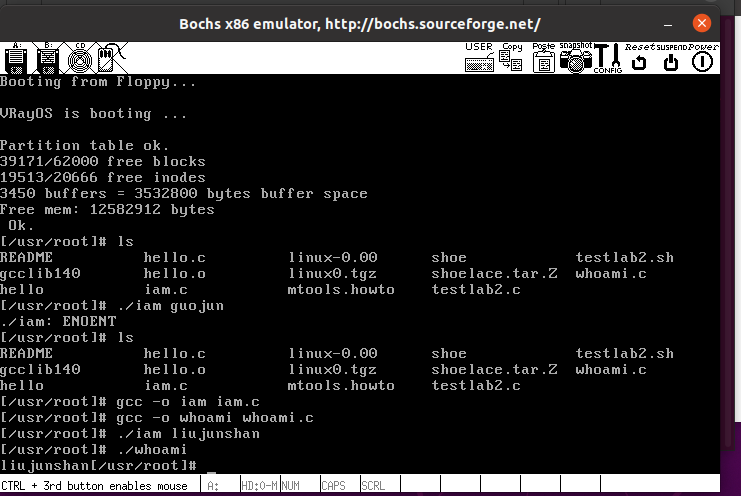
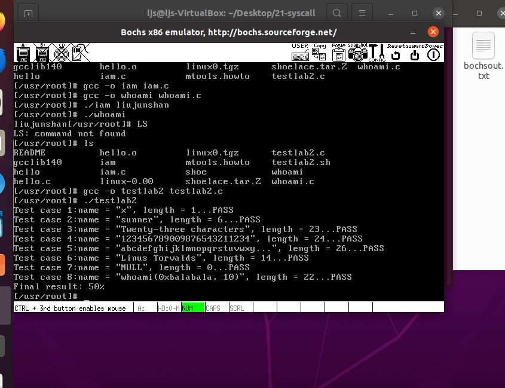
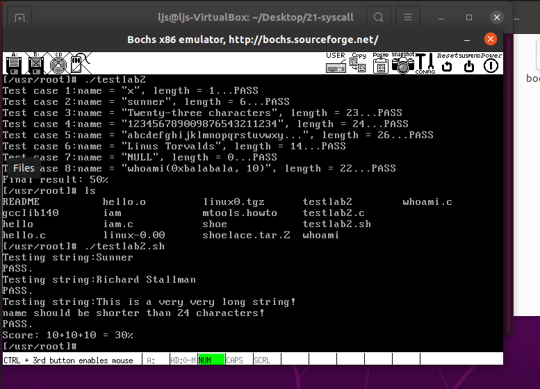

# 4 系统调用

### 4.1 实验结果

测试程序



`testlab2.c` 运行结果



`testlab2.sh` 运行结果



### 4.2 实验过程

在通常情况下，调用系统调用和调用一个普通的自定义函数在代码上并没有什么区别， 但调用后发生的事情有很大不同。 调用自定义函数是通过 `call` 指令直接跳转到该函数的地址，继续运行。 而调用系统调用，是调用系统库中为该系统调用编写的一个接口函数， 叫 **API** （Application Programming Interface）。 `API` 并不能完成系统调用的真正功能，它要做的是去调用真正的系统调用，过程是：

- 把系统调用的编号存入 `EAX`
- 把函数参数存入其它通用寄存器
- 触发 `0x80` 号中断（ `int 0x80` ）

```
#define _syscall1(type,name,atype,a) \
type name(atype a) \
{ \
long __res; \
__asm__ volatile ("int $0x80" \
	: "=a" (__res) \
	: "0" (__NR_##name),"b" ((long)(a))); \
if (__res >= 0) \
	return (type) __res; \
errno = -__res; \
return -1; \
}

```

将 `_syscall1(int,close,int,fd)` 进行宏展开，可以得到：

```
int close(int fd)
{
     long __res;
     __asm__ volatile ("int $0x80"
         : "=a" (__res)
         : "0" (__NR_close),"b" ((long)(fd)));
     if (__res >= 0)
         return (int) __res;
     errno = -__res;
     return -1;
}
```

修改`/kernel/system_call.s`

```
nr_system_calls = 74 # origin is 72, now add sys_iam and sys_whoami
```

修改调用表 `/include/linux/sys.h`

```
extern int sys_iam();
extern int sys_whoami();
```

`who.c`函数

```
#define __LIBRARY__
#include <unistd.h>
#include <string.h>
#include <errno.h>
#include <asm/segment.h>
char who[20];
int len = 0;

int sys_iam(const char * name)
{
    int i = 0;
    do
    {
        who[i] = get_fs_byte(name + i);
        if(i == 23 && who[23] != '\0')
            return -(EINVAL);
    }while(who[i++] != '\0');
    len = i - 1;
    return len;
}
int sys_whoami(char* name, unsigned int size)
{
    if(!len)
        return 0;
    if(size < len)
        return -(EINVAL);

    int i;
    for(i = 0; i < len; i++)
        put_fs_byte(who[i], name + i);

    return len;
}
```

修改 `Makefile`

`Makefile` 在代码树中有很多，分别负责不同模块的编译工作。我们要修改的是 `kernel/Makefile` 。 需要修改两处。一处是：

```
OBJS  = sched.o system_call.o traps.o asm.o fork.o \
        panic.o printk.o vsprintf.o sys.o exit.o \
        signal.o mktime.o
```

改为：

```
OBJS  = sched.o system_call.o traps.o asm.o fork.o \
        panic.o printk.o vsprintf.o sys.o exit.o \
        signal.o mktime.o who.o
```

另一处：

```
### Dependencies:
exit.s exit.o: exit.c ../include/errno.h ../include/signal.h \
  ../include/sys/types.h ../include/sys/wait.h ../include/linux/sched.h \
  ../include/linux/head.h ../include/linux/fs.h ../include/linux/mm.h \
  ../include/linux/kernel.h ../include/linux/tty.h ../include/termios.h \
  ../include/asm/segment.h
```

改为：

```
### Dependencies:
who.s who.o: who.c ../include/linux/kernel.h ../include/unistd.h
exit.s exit.o: exit.c ../include/errno.h ../include/signal.h \
  ../include/sys/types.h ../include/sys/wait.h ../include/linux/sched.h \
  ../include/linux/head.h ../include/linux/fs.h ../include/linux/mm.h \
  ../include/linux/kernel.h ../include/linux/tty.h ../include/termios.h \
  ../include/asm/segment.h
```

`Makefile` 修改后，和往常一样 `make all` 就能自动把 `who.c` 加入到内核中了。

编写`iam.c`

```
#define __LIBRARY__
#include <unistd.h>
#include <errno.h>


_syscall1(int, iam, const char*, name)

#define NAMELEN 100
char name[NAMELEN];

int main(int argc, char *argv[])
{
	int res;
	int namelen = 0;
	if (2 <= argc) {
		while ((name[namelen] = argv[1][namelen]) != '\0')
			namelen++; 
		printf("iam.c: %s, %d\n", name, namelen);
		res = iam(name);
			errno = EINVAL;
		return res;
	}
}
```

编写`whoami.c`

```
#define __LIBRARY__
#include <stdio.h>
#include <unistd.h>
#include <errno.h>


_syscall2(int, whoami, char*, name, unsigned int, size)

#define SIZE 23

int main(void)
{
	char name[SIZE+1];
	int res;
	res = whoami(name, SIZE+1);
	if (res == -1)
		errno = EINVAL;
	else
		printf("%s\n", name);
	return res;
}
```

挂载

```
sudo mount -t minix -o loop,offset=1024 ./hdc-0.11.img ./hdc
```

修改`/hdc/usr/include/unistd.h`

```
#define __NR_iam       72
#define __NR_whoami    73
```

编译运行

```
gcc iam.c -o iam
gcc whoami.c -o whoami
gcc testlab2.c -o testlab2
```


### 4.3 实验报告

#### 4.3.1 从 `Linux 0.11` 现在的机制看，它的系统调用最多能传递几个参数？

从Linux 0.11的机制看，它的系统调用最多能传递三个参数。因为`eax`存放了系统调用功能号，所以`ebx`、`ecx`、`edx`可以用于传递系统调用过程中要用到的参数 。

#### 4.3.2 你能想出办法来扩大这个限制吗？

在`unistd.h`中，将`_syscalln`对应的宏进行扩充。若n大于3，则可以采用`esi`,`edi`,`ebp`作为传递参数的寄存器，如此可以拓展系统调用中可传递参数个数，在宏展开的函数中先将`esi`,`edi`,`ebp`原来的值压栈，系统调用完成后再出栈恢复它们的原值。

还可用系统调用门的办法，在用户态堆栈和内核态堆栈自动复制传递参数。

#### 4.3.3 用文字简要描述向 `Linux 0.11` 添加一个系统调用 `foo()` 的步骤。

向Linux 0.11`中添加一个系统调用`foo()`的步骤为：

    1. 在内核中编写`foo()`对应的系统调用处理函数`sys_foo()`。
    2. `unistd.h`中添加系统调用`foo()`的功能号并在`kernel/system_call.s`中修改系统调用总数。
    3. 在`sys.h`中声明新的系统调用处理函数`sys_foo()`以及添加系统调用处理函数指针数组表中`sys_foo()`的索引值，索引值的位置要和功能号对应。
    4. 在`Makefile`中添加或者修改新系统调用处理函数`sys_foo()`所在文件的编译、链接要求。
    5.  在用户应用程序中提供系统调用`foo()`，并在需要处使用系统调用`foo()`。