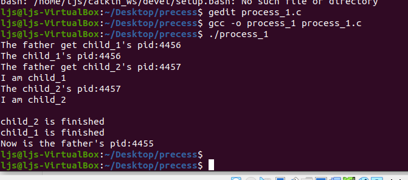
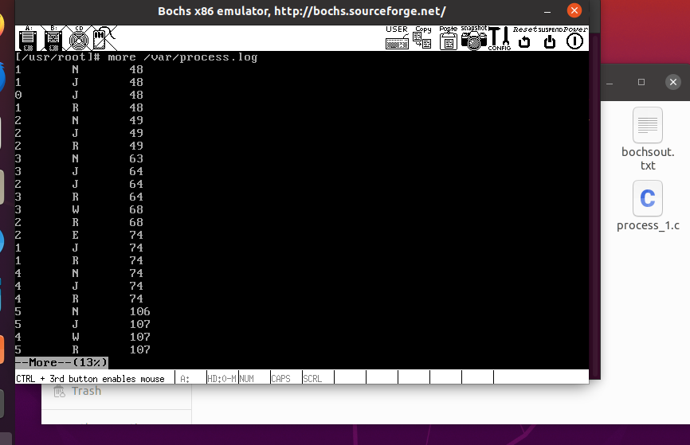
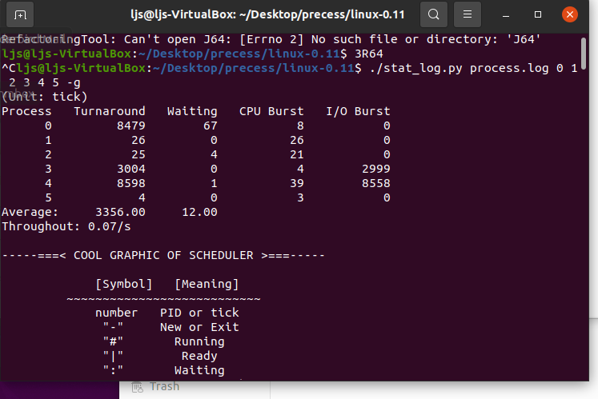
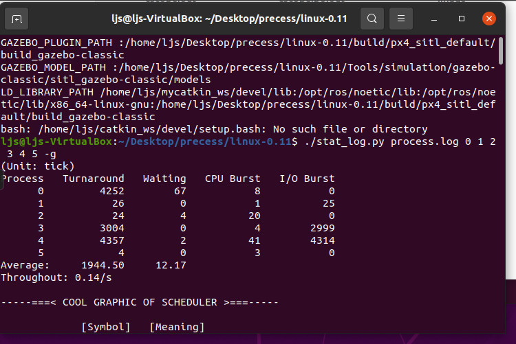
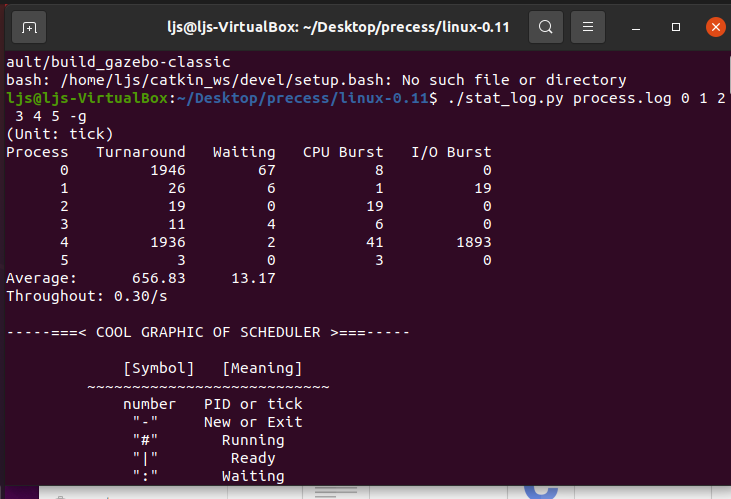

# 5. 进程运行轨迹的跟踪与统计

### 5.1 实验结果














### 5.2 实验过程

`last`总共占用的时间

`cpu_time`一次连续占用CPU的时间

`io_time`一次I/O消耗的时间

`tms_utime`记录的是进程执行用户代码的时间.
`tms_stime`记录的是进程执行内核代码的时间.
`tms_cutime`记录的是子进程执行用户代码的时间.
`tms_cstime`记录的是子进程执行内核代码的时间.

```
tms结构体如下:
strace tms{
 clock_t tms_utime;
 clock_t tms_stime;
 clock_t tms_cutime;
 clock_t tms_cstime;
}
```

```
void cpuio_bound(int last, int cpu_time, int io_time)
{
	struct tms start_time, current_time;
	clock_t utime, stime;
	int sleep_time;

	while (last > 0)
	{
		times(&start_time);
		do
		{
			times(&current_time);
			utime = current_time.tms_utime - start_time.tms_utime;
			stime = current_time.tms_stime - start_time.tms_stime;
		} while ( ( (utime + stime) / HZ )  < cpu_time );
		last -= cpu_time;
		if (last <= 0 )
			break;
		sleep_time=0;
		while (sleep_time < io_time)
		{
			sleep(1);
			sleep_time++;
		}
		last -= sleep_time;
	}
}
```

```
int main(int argc, char * argv[])
{
	pid_t father,child_1,child_2,son3,tmp1,tmp2,tmp3;
	tmp1=fork();
	if(tmp1==0)			/* child_1 */
	{
		child_1=getpid();
		printf("The child_1's pid:%d\n",child_1);
		printf("I am child_1\n");
		cpuio_bound(10, 3, 2);
		printf("child_1 is finished\n");
	}
	else if(tmp1>0)
	{
		child_1=tmp1;
		tmp2=fork();
		if(tmp2==0)		
		{
			child_2=getpid();
			printf("The child_2's pid:%d\n",child_2);
			printf("I am child_2\n");
			cpuio_bound(5, 1, 2);
			printf("child_2 is finished\n");
		}
		else if(tmp2>0)		
		{
			child_2=tmp2;
			father=getpid();
			printf("The father get child_1's pid:%d\n",tmp1);
			printf("The father get child_2's pid:%d\n",tmp2);
			wait((int *)NULL);
			wait((int *)NULL);
			printf("Now is the father's pid:%d\n",father);
		}
		else
			printf("Creat child_2 failed\n");
	}
	else
		printf("Creat child_1 failed\n");
	return 0;
}
```


`log` 文件将被用来记录进程的状态转移轨迹。所有的状态转移都是在内核进行的。 在内核状态下， `write()` 功能失效，其原理等同于《系统调用》实验中不能在内核状态调用 `printf()` ， 只能调用 `printk()` 。

因为和 `printk` 的功能近似，建议将此函数放入到 `kernel/printk.c` 中。 `fprintk()` 的使用方式与 `C` 标准库函数 `fprintf()` 相似 ，唯一的区别是第一个参数是文件描述符，而不是文件指针。

```
fprintk(1, "The ID of running process is %ld", current->pid); //向stdout打印正在运行的进程的ID
fprintk(3, "%ld\t%c\t%ld\n", current->pid, 'R', jiffies); //向log文件输出
```

`jiffies` 表示从开机时到现在发生的时钟中断次数，这个数也被称为 **滴答数**。

`fork()` 功能在内核中实现为 `sys_fork()` ，该“函数”在文件 `kernel/system_call.s` 中实现为：

```
sys_fork:
    call find_empty_process

    # ……

    push  %gs   # 传递一些参数
    pushl %esi
    pushl %edi
    pushl %ebp
    pushl %eax
    call copy_process  # 调用copy_process实现进程创建
    addl $20,%esp
```

在`linux 0.11`中进程状态其实只有就绪（运行）、等待、退出，处于就绪态的进程一旦得到CPU就进入到运行态。这也是系统调度的基础，就是看所有就绪态的进程哪个应该被运行（看时间片）。生成的进程状态有两种改变情形，一种是被抢占（时间片调度），一种是主动让出（等待）。其中抢占只发生在调度时，等待则有以下几种情形，`sys_pause`（主动暂停），`sys_waitpid`（等待子进程结束），`sleep_on`（睡眠）以及不可中断睡眠，而睡眠的进程被唤醒则有主动唤醒及信号唤醒。被唤醒的进程则参与调度，会再一次使用CPU。进程运行结束或被手工杀死后，进程状态会变为僵尸进程，会在调度过程中被释放。所以真正实现进程创建的函数是 `copy_process()`，它在 `kernel/fork.c` 中定义为：

因此要完成进程运行轨迹的记录就要在 `copy_process()` 中添加输出语句。

这里要输出两种状态，分别是“N（新建）”和“J（就绪）”。

```
int copy_process(int nr,……)
{
    struct task_struct *p;
//    ……
// 获得一个 task_struct 结构体空间
    p = (struct task_struct *) get_free_page();  
//    ……
    p->pid = last_pid;
//    ……
// 设置 start_time 为 jiffies
    p->start_time = jiffies;
//  @yyf change
    fprintk(3, "%ld\t%c\t%ld\n", p->pid, 'N', jiffies); 
//       ……
/* 设置进程状态为就绪。所有就绪进程的状态都是
   TASK_RUNNING(0），被全局变量 current 指向的
   是正在运行的进程。*/
    p->state = TASK_RUNNING;    
//  @yyf change
    fprintk(3, "%ld\t%c\t%ld\n", p->pid, 'J', jiffies); 
    
    return last_pid;
}

```

记录进入睡眠态的时间。sleep_on() 和 interruptible_sleep_on() 让当前进程进入睡眠状态，这两个函数在 `kernel/sched.c`文件中

```
void sleep_on(struct task_struct **p)
{
	struct task_struct *tmp;

	if (!p)
		return;
	if (current == &(init_task.task))
		panic("task[0] trying to sleep");
	tmp = *p;
	*p = current;
	current->state = TASK_UNINTERRUPTIBLE;
/*添加进程阻塞态输出语句,输出到process.log文件中*/
    fprintk(3,"%ld\t%c\t%ld\n",current->pid,'W',jiffies);
	schedule();
	*p = tmp;
    if (tmp)
	{
		tmp->state=TASK_RUNNING;
                fprintk(3,"%ld\t%c\t%ld\n",tmp->pid,'J',jiffies);      
                /*添加进程就绪输出语句,输出到process.log文件中*/
    }
}

```

进程退出

```
int do_exit(long code)
{
	int i;
	free_page_tables(get_base(current->ldt[1]),get_limit(0x0f));
	free_page_tables(get_base(current->ldt[2]),get_limit(0x17));
	for (i=0 ; i<NR_TASKS ; i++)
		if (task[i] && task[i]->father == current->pid) {
			task[i]->father = 1;
			if (task[i]->state == TASK_ZOMBIE)
				/* assumption task[1] is always init */
				(void) send_sig(SIGCHLD, task[1], 1);
		}
	for (i=0 ; i<NR_OPEN ; i++)
		if (current->filp[i])
			sys_close(i);
	iput(current->pwd);
	current->pwd=NULL;
	iput(current->root);
	current->root=NULL;
	iput(current->executable);
	current->executable=NULL;
	if (current->leader && current->tty >= 0)
		tty_table[current->tty].pgrp = 0;
	if (last_task_used_math == current)
		last_task_used_math = NULL;
	if (current->leader)
		kill_session();
	current->state = TASK_ZOMBIE;
	fprintk(3, "%ld\t%c\t%ld\n", current->pid, 'E', jiffies);
	current->exit_code = code;
	tell_father(current->father);
	schedule();
	return (-1);	/* just to suppress warnings */
}

```


Linux 0.11 支持四种进程状态的转移：就绪到运行、运行到就绪、运行到睡眠和睡眠到就绪，此外还有新建和退出两种情况。其中就绪与运行间的状态转移是通过 schedule()（它亦是调度算法所在）完成的；运行到睡眠依靠的是 sleep_on() 和 interruptible_sleep_on()，还有进程主动睡觉的系统调用 sys_pause() 和 sys_waitpid()；睡眠到就绪的转移依靠的是 wake_up()。所以只要在这些函数的适当位置插入适当的处理语句就能完成进程运行轨迹的全面跟踪了。


一种可能的情况下，得到的 `process.log` 文件的前几行是：

```
1    N    48    //进程1新建（init()）。此前是进程0建立和运行，但为什么没出现在log文件里？
1    J    49    //新建后进入就绪队列
0    J    49    //进程0从运行->就绪，让出CPU
1    R    49    //进程1运行
2    N    49    //进程1建立进程2。2会运行/etc/rc脚本，然后退出
2    J    49
1    W    49    //进程1开始等待（等待进程2退出）
2    R    49    //进程2运行
3    N    64    //进程2建立进程3。3是/bin/sh建立的运行脚本的子进程
3    J    64
2    E    68    //进程2不等进程3退出，就先走一步了
1    J    68    //进程1此前在等待进程2退出，被阻塞。进程2退出后，重新进入就绪队列
1    R    68
4    N    69    //进程1建立进程4，即shell
4    J    69
1    W    69    //进程1等待shell退出（除非执行exit命令，否则shell不会退出）
3    R    69    //进程3开始运行
3    W    75
4    R    75
5    N    107    //进程5是shell建立的不知道做什么的进程
5    J    108
4    W    108
5    R    108
4    J    110
5    E    111    //进程5很快退出
4    R    111
4    W    116    //shell等待用户输入命令。
0    R    116    //因为无事可做，所以进程0重出江湖
4    J    239    //用户输入命令了，唤醒了shell
4    R    239
4    W    240
0    R    240
……
```

### 数据统计

为展示实验结果，需要编写一个数据统计程序，它从 `log` 文件读入原始数据，然后计算平均周转时间、平均等待时间和吞吐率。任何语言都可以编写这样的程序，实验者可自行设计。我们用 `python` 语言编写了一个—— `stat_log.py` （这是 `python` 源程序，可以用任意文本编辑器打开）。


```
ljs@ljs-VirtualBox:~/Desktop/precess/linux-0.11$ ./stat_log.py process.log 0 1 2 3 4 5 -g
(Unit: tick)
Process   Turnaround   Waiting   CPU Burst   I/O Burst
      0         8479        67           8           0
      1           26         0          26           0
      2           25         4          21           0
      3         3004         0           4        2999
      4         8598         1          39        8558
      5            4         0           3           0
Average:     3356.00     12.00
Throughout: 0.07/s

-----===< COOL GRAPHIC OF SCHEDULER >===-----

             [Symbol]   [Meaning]
         ~~~~~~~~~~~~~~~~~~~~~~~~~~~
             number   PID or tick
              "-"     New or Exit 
              "#"       Running
              "|"        Ready
              ":"       Waiting
                    / Running with 
              "+" -|     Ready 
                    \and/or Waiting

-----===< !!!!!!!!!!!!!!!!!!!!!!!!! >===-----

   40 -0                      
   41 #0                      
   42 #                       
   43 #                       
   44 #                       
   45 #                       
   46 #                       
   47 #                       
   48 |0  -1                  
   49 |   #1  -2              
   50 |   #   #2              
   51 |   #   #               
   52 |   #   #               
   53 |   #   #               
   54 |   #   #               
   55 |   #   #               
   56 |   #   #               
   57 |   #   #               
   58 |   #   #               
   59 |   #   #               
   60 |   #   #               
   61 |   #   #               
   62 |   #   #               
   63 |   #   #   -3          
   64 |   #   |2  +3          
   65 |   #   |   #3          
   66 |   #   |   #           
   67 |   #   |   #           
   68 |   #   #2  :3          
   69 |   #   #   :           
   70 |   #   #   :           
   71 |   #   #   :           
   72 |   #   #   :           
   73 |   #   #   :           
   74 |   +1  -2  :   -4      
   75 |           :   #4      
   76 |           :   #       
   77 |           :   #       
   78 |           :   #       
   79 |           :   #       
   80 |           :   #       
   81 |           :   #       
   82 |           :   #       
   83 |           :   #       
   84 |           :   #       
   85 |           :   #       
   86 |           :   #       
   87 |           :   #       
   88 |           :   #       
   89 |           :   #       
   90 |           :   #       
   91 |           :   #       
   92 |           :   #       
   93 |           :   #       
   94 |           :   #       
   95 |           :   #       
   96 |           :   #       
   97 |           :   #       
   98 |           :   #       
   99 |           :   #       
  100 |           :   #       
  101 |           :   #       
  102 |           :   #       
  103 |           :   #       
  104 |           :   #       
  105 |           :   #       
  106 |           :   #   -5  
  107 |           :   :4  +5  
  108 |           :   :   #5  
  109 |           :   |4  #   
  110 |           :   #4  -5  
  111 |           :   #       
  112 |           :   #       
  113 |           :   #       
  114 |           :   #       
  115 #0          :   :4      
  116 #           :   :       
  117 #           :   :       
  118 #           :   :       
  119 #           :   :       
  120 #           :   :       
  121 #           :   :       
  122 #           :   :       
  123 #           :   :       
  124 #           :   :       
  125 #           :   :       
  126 #           :   :       
  127 #           :   :       
  128 #           :   :       
  129 #           :   :       
  130 #           :   :       
  131 #           :   :       
  132 #           :   :       
  133 #           :   :       
  134 #           :   :       
  135 #           :   :       
  136 #           :   :       
  137 #           :   :       
  138 #           :   :       
  139 #           :   :       
  140 #           :   :       
  141 #           :   :       
  142 #           :   :       
  143 #           :   :       
  144 #           :   :       
  145 #           :   :       
  146 #           :   :       
  147 #           :   :       
  148 #           :   :       
  149 #           :   :       
  150 #           :   :       
  151 #           :   :       
  152 #           :   :       
  153 #           :   :       
  154 #           :   :       
  155 #           :   :       
  156 #           :   :       
  157 #           :   :       
  158 #           :   :       

```

### 修改时间片

下面是 `0.11` 的调度函数 `schedule` ，在文件 `kernel/sched.c` 中定义为：

```
while (1) {
    c = -1; next = 0; i = NR_TASKS; p = &task[NR_TASKS];
    while (--i) {
        if (!*--p)    continue;
        if ((*p)->state == TASK_RUNNING && (*p)->counter > c)
            c = (*p)->counter, next = i;
    }                //找到counter值最大的就绪态进程
    if (c) break;    //如果有counter值大于0的就绪态进程，则退出
    for(p = &LAST_TASK ; p > &FIRST_TASK ; --p)
          if (*p) (*p)->counter = ((*p)->counter >> 1) + (*p)->priority;
                        //如果没有，所有进程的counter值除以2衰减后再和priority值相加，产生新的时间片
}
switch_to(next);  //切换到next进程
```

分析代码可知， `0.11` 的调度算法是选取 `counter` 值最大的就绪进程进行调度。 其中运行态进程（即 `current` ）的 `counter` 数值会随着时钟中断而不断减 `1` （时钟中断 `10ms` 一次）， 所以是一种比较典型的时间片轮转调度算法。另外，由上面的程序可以看出，当没有 `counter` 值大于 `0` 的就绪进程时， 要对所有的进程做

```
(*p)->counter = ((*p)->counter >> 1) + (*p)->priority
```

在 `include/linux/sched.h` 中，存放了进程 0 的 **`INIT_TASK` 宏**，其**第三项**就是 `priority` 值。

```
#define INIT_TASK \
/* state etc */	{ 0,15,15, \
/* signals */	0,{{},},0, \
⋮
}
```

```
#define INIT_TASK \
/* state etc */	{ 0,15,5, \
```


```
#define INIT_TASK \
/* state etc */	{ 0,15,15, \
```


```
#define INIT_TASK \
/* state etc */	{ 0,15,150, \
```


### 5.3 实验报告

#### 5.3.1. 结合自己的体会，谈谈从程序设计者的角度看，单进程编程和多进程编程最大的区别是什么？

##### 5.3.1.1 单进程编程

对于规模比较小的程序而言，单进程程序编写简单，不易出错，而且执行效率比较高，速度比较快，而且可以通过同进程的多个线程之间进行相互通讯和交换数据，线程间的关系比较紧密也便于管理，启动一个线程的开销要比启动进程的开销要小的多，但缺点是相互的影响比较大，若某个线程崩溃可能影响同一进程下的其他线程无法正常工作，要等待所有进程结束之后才能进行下一步处理。

##### 5.3.1.2 多进程编程

对于比较复杂、规模较大的程序任务，则多进程的优势非常明显，多进程的独立性强，有各自独立的代码段和数据段，相互影响较小，适合于独立工作。但缺点是系统必须为新创建的进程创建代码段，数据段和堆栈段。这种多任务的实现方式使得在创建新进程时，需要花费大量系统的资源，进程之间切换的代价较高。

##### 5.3.1.3 单进程编程和多进程编程最大的区别

二者最大区别是，多进程需要使用多个独立的代码段、数据段和堆栈段，创建和切换的开销较大，而且多个进程间的通信较单进程编程要更为复杂，但它比单进程下多线程工作要更稳定。而且更有利于同时执行多个独立的任务。

### 5.3.2. 你是如何修改时间片的？仅针对样本程序建立的进程，在修改时间片前后， `log` 文件的统计结果（不包括Graphic）都是什么样？结合你的修改分析一下为什么会这样变化，或者为什么没变化？

通过修改`INIT_TASK`中的`priority`的值来修改时间片的大小的，因为所有进程其实都是进程1的子进程，而进程1是任务0的子进程，因此所有进程的优先权都是继承自任务0的。

统计结果:时间片的大小决定了任务切换的频率，当时间片越大时，任务切换的频率越低，因此进程的等待时间会增大；而当时间片越小时，任务切换的频率过高，切换开销变得更大，进程的等待时间也会增加。

修改时间片前，由于程序中创建的子进程一次连续占用`cpu`的时间比时间片要大，因此样本程序中子进程还未执行完，就被调度为就绪状态了。占用`cpu`的子进程在R状态后15个滴答后就转为J状态了，而把时间片修改到30个滴答后，虽然子进程仍然是未执行完就被调度了，但一次运行的滴答明显改变了。而对于样本程序中不占用`cpu`只占用`I/O`的进程则没变化，因为一旦执行，就进入睡眠等待状态，等待`I/O`处理。